# SISOP-4-2026-IT-063

## Dewa Ngakan Gede Wira Adhimukti - 5027251063

## SOAL 1 - Save Asisten Kenz

### a. Ambil Arsip
Pada soal ini, hal pertama yang harus dilakukan adalah mengambil arsip yang tertera, hal tersebut dapat dilakukan dengan menggunakan `gdown`.

```
gdown https://drive.google.com/file/d/1nLXFhptDo2mnUlZsw8pTWyAVpV49W20U/view?usp=drive_link
```

Setelah file berhasil didownload, file tersebut harus di unzip dan kemudian file zip harus dihapus sehingga hanya menyisakan folder hasil unzip.

- Unzip file
```
unzip amba_files.zip
```

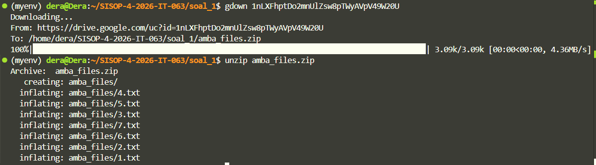

- Hapus file
```
rm -rf amba_files.zip
```

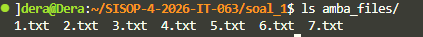

### b. Buat Program FUSE
Selanjutnyua, soal meminta untuk membuat program FUSE bernama `kenz_rescue.c`. Program tersebut akan menerima dua argumen yaitu <source_directory> dan <mount_directory>. Saat program di-mount, ketujuh file 1.txt sampai 7.txt harus muncul di mount directory dengan isi sama persis dengan source-passthrough untuk callback, readdir, open, dan read (mount directory hanya bertindak sebagai filesystem cermin yang hanya meneruskan operasi ke source)

```c
int main(int argc, char *argv[])
{
    if (argc != 3) {
        fprintf(stderr, "Usage: %s [source] [destination]\n", argv[0]);
        return 1;
    }

    realpath(argv[1], dirpath);  // Convert ke absolute path
    fprintf(stderr, "[INFO] Source directory: %s\n", dirpath);

    snprintf(overlaypath, sizeof(overlaypath), "/tmp/fuse_overlay_%d", getpid());
    mkdir(overlaypath, 0700);
    fprintf(stderr, "[INFO] Overlay directory: %s\n", overlaypath);

    struct stat st = {0};
    if (stat(argv[2], &st) == -1)
        mkdir(argv[2], 0755);

    argv[1] = argv[2];
    argc = 2;

    return fuse_main(argc, argv, &xmp_oper, NULL);
}
```

Fungsi `main()`berperan sebagai titik awal program FUSE. Program ini membutuhkan dua argumen, yaitu source directory dan mount directory. Source directory adalah folder asli yang akan dijadikan sumber data, sedangkan destination atau mount directory adalah folder tempat filesystem FUSE akan dipasang. Karena itu, program pertama-tama mengecek apakah jumlah argumen adalah 3, yaitu nama program, source, dan destination. Jika jumlah argumen tidak sesuai, program akan menampilkan format penggunaan yang benar lalu berhenti.

Setelah argumen valid, program memanggil `realpath(argv[1], dirpath)`. Fungsi ini digunakan untuk mengubah path source yang diberikan user menjadi absolute path. Hasil absolute path ini kemudian disimpan ke variabel global `dirpath`, sehingga seluruh fungsi FUSE lain dapat mengakses lokasi source directory dengan jelas dan konsisten.

Selanjutnya, program membuat sebuah directory overlay sementara di dalam `/tmp`. Nama folder overlay dibuat unik menggunakan PID dari proses yang sedang berjalan, yaitu dengan format `/tmp/fuse_overlay_<PID>`. Directory ini disimpan dalam variabel `overlaypath`. Tujuan overlay ini adalah untuk menyimpan file-file hasil perubahan atau penulisan dari user, tanpa langsung mengubah isi directory sumber utama. Hal ini membuat source directory bisa tetap aman, sementara perubahan disimpan di tempat terpisah.

Setelah itu, program mengecek apakah mount directory yang diberikan melalui `argv[2]` sudah ada atau belum. Pengecekan dilakukan menggunakan `stat()`. Jika folder mount tersebut belum ada, maka program akan membuatnya secara otomatis dengan permission `0755`. Folder inilah yang nantinya akan menjadi tempat user melihat dan berinteraksi dengan filesystem FUSE.

 Awalnya program menerima dua argumen dari user, yaitu source dan destination. Namun, `fuse_main()` hanya perlu mengetahui mount path sebagai argumen utama FUSE. Karena itu, `argv[1]` diganti menjadi `argv[2]`, lalu `argc` diubah menjadi `2`. Dengan begitu, argumen yang diteruskan ke FUSE hanya berisi nama program dan mount directory.

Selanjutnya, program memanggil `fuse_main(argc, argv, &xmp_oper, NULL)`. Fungsi ini menjalankan FUSE dan menghubungkan filesystem dengan kumpulan callback operation yang ada di `xmp_oper`, seperti operasi membaca file, menulis file, membuka directory, menghapus file, dan lain-lain. Setelah fungsi ini berjalan, filesystem akan aktif di mount path, dan setiap operasi yang dilakukan user di folder tersebut akan diteruskan ke fungsi-fungsi callback yang sudah didefinisikan.

#### HASIL AKHIR:
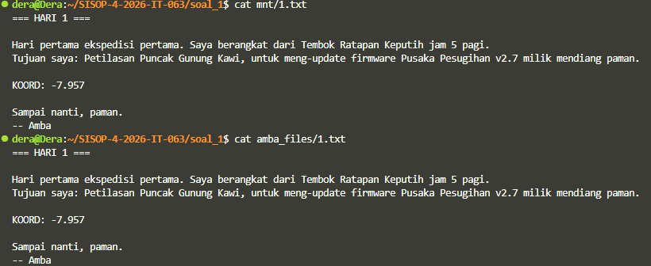

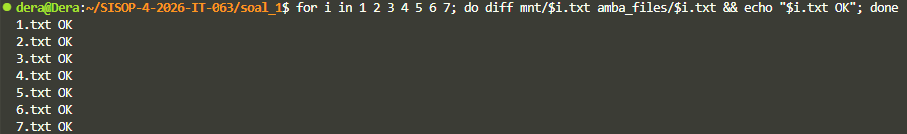

### c. Buat File Virtual
Soal lalu meminta untuk menambahkan satu file virtual bernama tujuan.txt di root mount directory. File ini harus muncul di `ls mnt/`, ukurannya konsisten saat di-stat, tapi tidak boleh punya kesamaan fisik di amba_files/.

- Cek path
```c
static inline int is_tujuan(const char *path)
{
    return strcmp(path, "/tujuan.txt") == 0;
}

static inline int tujuan_exists()
{
    char fpath[1000];
    snprintf(fpath, sizeof(fpath), "%s/tujuan.txt", overlaypath);
    return access(fpath, F_OK) == 0;
}
```
Fungsi `is_tujuan(path)` berfungsi untuk mengecek apakah path yang sedang diakses adalah `/tujuan.txt`, sehingga program bisa mengenali bahwa operasi tersebut ditujukan ke file khusus tersebut. Fungsi `tujuan_exists()` digunakan untuk mengecek apakah file `tujuan.txt` sudah benar-benar ada di dalam overlay directory, yaitu folder sementara yang sebelumnya dibuat di `/tmp/fuse_overlay_<PID>/`. Di dalam fungsi ini, path lengkap menuju file `tujuan.txt` dibentuk menggunakan `snprintf()`, lalu dicek dengan `access(fpath, F_OK)`. Jika file tersebut ada, fungsi akan mengembalikan nilai `1` atau true, sedangkan jika tidak ada akan mengembalikan `0` atau false. Jadi, ketika menjalankan perintah seperti `touch /mount/tujuan.txt`, file kosong akan dibuat di overlay directory, dan fungsi ini dapat digunakan untuk memeriksa apakah file tersebut sudah tersedia atau belum.

- Ukuran konsisten

```c
static int xmp_getattr(const char *path, struct stat *stbuf)
{
    if (is_tujuan(path) && tujuan_exists()) {
        char content[8192];
        int  len = generate_tujuan(content, sizeof(content));

        memset(stbuf, 0, sizeof(*stbuf));
        stbuf->st_mode  = S_IFREG | 0644;  // regular file, rw-r--r--
        stbuf->st_nlink = 1;
        stbuf->st_size  = len; // size = panjang konten virtual
        return 0;
    }

    char fpath[1000];
    snprintf(fpath, sizeof(fpath), "%s%s", overlaypath, path);
    if (lstat(fpath, stbuf) == 0)
        return 0;

    snprintf(fpath, sizeof(fpath), "%s%s", dirpath, path);
    if (lstat(fpath, stbuf) == -1)
        return -errno;

    return 0;
}
```
Fungsi `xmp_getattr()` digunakan untuk mengambil metadata sebuah file atau folder di filesystem FUSE, misalnya ketika user menjalankan `ls -l`, `stat`, atau ketika sistem perlu mengetahui ukuran dan permission sebuah file. Pada soal ini, fungsi tersebut terlebih dahulu mengecek apakah path yang diakses adalah "/tujuan.txt" dan apakah file tersebut sudah ada di overlay directory. Jika iya, maka `generate_tujuan()` dipanggil untuk menghitung panjang konten virtual yang akan ditampilkan. Setelah itu, `stbuf` diisi manual dengan metadata `file: st_mode` menandakan bahwa `tujuan.txt` adalah regular file dengan `permission 0644`, `st_nlink` bernilai 1, dan `st_size` diisi berdasarkan panjang konten hasil generate, sehingga ukuran file tidak dianggap kosong meskipun isi sebenarnya dibangkitkan secara virtual.

- Buat file
```c
static int xmp_create(const char *path, mode_t mode, struct fuse_file_info *fi)
{
    char fpath[1000];
    snprintf(fpath, sizeof(fpath), "%s%s", overlaypath, path);

    int fd = open(fpath, O_CREAT | O_WRONLY | O_TRUNC, mode);
    if (fd == -1)
        return -errno;

    fi->fh = fd;
    return 0;
}
```

Fungsi `xmp_create()` digunakan ketika user membuat file baru di mount FUSE, misalnya saat menjalankan `touch /mount/tujuan.txt`. Di dalam fungsi ini, program terlebih dahulu membentuk path lengkap file di overlay directory dengan menggabungkan `overlaypath` dan `path`, sehingga `"/tujuan.txt"` akan diarahkan menjadi file fisik seperti `/tmp/fuse_overlay_<PID>/tujuan.txt`. Setelah itu, file dibuka menggunakan `open()` dengan flag `O_CREAT | O_WRONLY | O_TRUNC`, yang berarti file akan dibuat jika belum ada, dibuka dalam mode tulis saja, dan dikosongkan jika sebelumnya sudah ada. Jika proses pembuatan gagal, fungsi mengembalikan `-errno` sebagai kode error FUSE. Jika berhasil, file descriptor disimpan ke `fi->fh` agar dapat digunakan oleh operasi FUSE berikutnya seperti write atau release. Pada dasarnya, fungsi ini membuat file kosong di overlay, dan khusus untuk `tujuan.txt`, keberadaan file kosong ini menjadi semacam “trigger” bahwa file virtual sudah aktif, sehingga setelah `touch` dijalankan, `tujuan_exists()` akan mengembalikan true dan `tujuan.txt` mulai bisa dibaca melalui konten yang dibangkitkan secara virtual.

#### HASIL AKHIR:
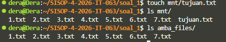

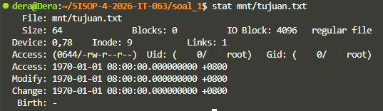
### d. Temukan Koordinat Ritual
Saat `cat mnt/tujuan.txt` dijalankan, isinya dibangkitkan on-the-fly (dibuat saat dibutuhkan, tidak disimpan di disk) dengan menggabungkan fragmen KOORD: <...> dari 1.txt sampai 7.txt. Format: "Tujuan Mas Amba: <gabungan fragmen>" diakhir tepat satu newline.

- Logika Utama
```c
static int generate_tujuan(char *out, size_t maxlen)
{
    char result[8192];
    int  rlen = snprintf(result, sizeof(result), "Tujuan Mas Amba: ");

    for (int i = 1; i <= 7; i++) {
        char fpath[1000];
        snprintf(fpath, sizeof(fpath), "%s/%d.txt", dirpath, i);

        FILE *f = fopen(fpath, "r");
        if (!f) {
            fprintf(stderr, "[DEBUG] File tidak ada: %s\n", fpath);
            continue;
        }

        char line[2048];
        while (fgets(line, sizeof(line), f)) {
            char *p = strstr(line, "KOORD:");
            if (!p)
                continue;

            p += strlen("KOORD:");
            while (*p && isspace(*p)) p++;
            
            char *end = strchr(p, '\n');
            if (!end) end = p + strlen(p);
            while (end > p && isspace(*(end-1))) end--;

            size_t fraglen = (size_t)(end - p);
            if (fraglen == 0) continue;
            
            fprintf(stderr, "[DEBUG] Found fragment #%d (len=%zu): ", i, fraglen);
            fwrite(p, 1, fraglen, stderr);
            fprintf(stderr, "\n");

            if (rlen + (int)fraglen + 2 < (int)sizeof(result)) {
                memcpy(result + rlen, p, fraglen);
                rlen += (int)fraglen;
            }
        }
        fclose(f);
    }

    if (rlen < (int)sizeof(result) - 1) {
        result[rlen++] = '\n';
        result[rlen]   = '\0';
    }

    fprintf(stderr, "[DEBUG] Final result length: %d\n", rlen);
    fprintf(stderr, "[DEBUG] Final result: %s", result);

    size_t copy = (size_t)rlen < maxlen ? (size_t)rlen : maxlen;
    memcpy(out, result, copy);
    return (int)copy;
}
```

#### 1 - Inisialisasi

```c
char result[8192];
int  rlen = snprintf(result, sizeof(result), "Tujuan Mas Amba: ");
```
Kode di atas berfugnsi untuk mengalokasikan buffer `result` untuk menyimpan string akhir denan inisialisasi prefix "Tujuan Mas Amba: ". Variabel `rlen` sendiri adalah pointer posisi untuk apend selanjutnya.

#### 2 - Loop Baca File

```c
 for (int i = 1; i <= 7; i++) {
        char fpath[1000];
        snprintf(fpath, sizeof(fpath), "%s/%d.txt", dirpath, i);

        FILE *f = fopen(fpath, "r");
        if (!f) {
            fprintf(stderr, "[DEBUG] File tidak ada: %s\n", fpath);
            continue;
        }

        char line[2048];
        while (fgets(line, sizeof(line), f)) {
            char *p = strstr(line, "KOORD:");
            if (!p)
                continue;

            p += strlen("KOORD:");
            while (*p && isspace(*p)) p++;
            
            char *end = strchr(p, '\n');
            if (!end) end = p + strlen(p);
            while (end > p && isspace(*(end-1))) end--;

            size_t fraglen = (size_t)(end - p);
            if (fraglen == 0) continue;
            
            fprintf(stderr, "[DEBUG] Found fragment #%d (len=%zu): ", i, fraglen);
            fwrite(p, 1, fraglen, stderr);
            fprintf(stderr, "\n");

            if (rlen + (int)fraglen + 2 < (int)sizeof(result)) {
                memcpy(result + rlen, p, fraglen);
                rlen += (int)fraglen;
            }
        }
        fclose(f);
    }

```

Program lalu akan membuka dan membaca file `1.txt` hingga `7.txt` dan membaca baris per baris isi file tersebut. Program akan fokus mencari string "KOORD: " di setiap baris dan akan melewati baris yang tidak memiliki string yang dicari. Setelah menemukan string "KOORD: ", program akan melakukan parsing fragmen setelah string tersebutd dan melalukan append hasil fragmen ke `result`.

#### 4 - Newline

```c
if (rlen < (int)sizeof(result) - 1) {
    result[rlen++] = '\n';
    result[rlen]   = '\0';
}
```

Fungsi di atas akan menambah tepat satu newline di akhir dan set null terminator untuk string.

#### HASIL AKHIR:
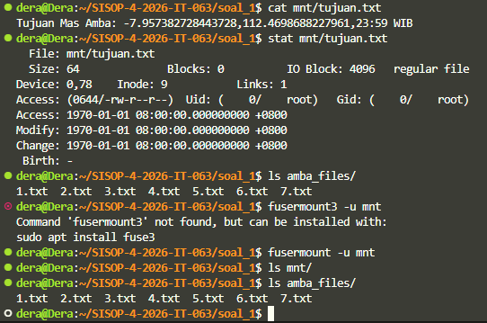

### SOAL 2 - Poke MOO

#### a - Buat fuse.c
Soal meminta untuk membuat file `fuse.c` yang mengaplikasikan 12 callback function dari FUSE Library. Callback function adalah fungsi yang dipanggil oleh FUSE daemon ketika kernel mengirimkan operasi filesystem. Setiap callback menangani satu jenis operasi filesystem.

- Struktur dan definisi
```c
#define FUSE_USE_VERSION 26
#include <fuse.h>
#include <stdio.h>
#include <stdlib.h>
#include <string.h>
#include <unistd.h>
#include <fcntl.h>
#include <sys/stat.h>
#include <dirent.h>
#include <errno.h>
#include <sys/xattr.h>
#include <sys/time.h>

#define ENCRYPTION_KEY 0x76
#define MAX_PATH 4096

typedef struct {
    char *encrypted_dir;
} fuse_context_t;
```

Contoh beberapa implementasi callback function yaitu sebagai berikut:
- getattr
```c
static int moo_getattr(const char *path, struct stat *stbuf) {
    fuse_context_t *ctx = (fuse_context_t *)fuse_get_context()->private_data;
    char encrypted_path[MAX_PATH];
    get_encrypted_path(path, encrypted_path, ctx->encrypted_dir);

    int res = stat(encrypted_path, stbuf);
    if (res == -1)
        return -errno;

    return 0;
}
```

- readdir

```c
static int moo_readdir(const char *path, void *buf, fuse_fill_dir_t filler, off_t offset, struct fuse_file_info *fi) {
    (void)offset;
    (void)fi;

    fuse_context_t *ctx = (fuse_context_t *)fuse_get_context()->private_data;
    char encrypted_path[MAX_PATH];
    get_encrypted_dir_path(path, encrypted_path, ctx->encrypted_dir);

    DIR *dp = opendir(encrypted_path);
    if (!dp)
        return -errno;

    struct dirent *de;
    while ((de = readdir(dp)) != NULL) {
        struct stat st;
        memset(&st, 0, sizeof(st));
        st.st_ino = de->d_ino;
        st.st_mode = de->d_type << 12;

        char decrypted_name[256];
        get_decrypted_filename(de->d_name, decrypted_name);

        if (filler(buf, decrypted_name, &st, 0))
            break;
    }

    closedir(dp);
    return 0;
```

Implementasi callback function lainnya mengikuti pattern yang sama, yakni mengambil path dari FUSE, mengkonversi ke encrypted path, memanggil system call yang sesuai pada encrypted path, dan mengembalikan hasil.

Callback function lalu didaftarkan di struck dan `main` function dipanggil.
```c
static struct fuse_operations moo_oper = {
    .getattr = moo_getattr,
    .readdir = moo_readdir,
    .mkdir = moo_mkdir,
    .rmdir = moo_rmdir,
    .create = moo_create,
    .open = moo_open,
    .read = moo_read,
    .write = moo_write,
    .truncate = moo_truncate,
    .unlink = moo_unlink,
    .access = moo_access,
    .utimens = moo_utimens,
    .flush = moo_flush,
};

int main(int argc, char *argv[]) {
    // ... setup code ...
    return fuse_main(argc, argv, &moo_oper, &ctx);
}
```

#### Server
Untuk memperoleh file `server` yang disediakan soal, file harus didwonlaod terbelih dahulu menggunakan `gdown`

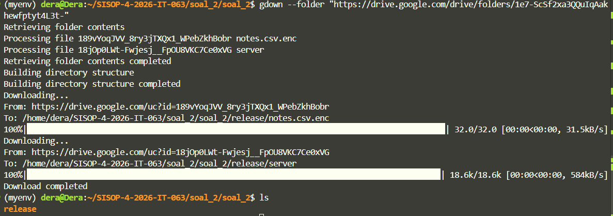

#### b - Mounting
Soal meminta agar `fuse_mount/` berfungsi seperti direktori normal yang dapat dibaca dan ditulis. User harus bisa melakukan semua operasi filesystem standar (membuat file/folder, membaca, menghapus, dll) pada `fuse_mount/` seolah-olah itu direktori biasa. Operasi apapun yang dilakukan pada `fuse_mount/` harus tercermin di `encrypted_storage/`.

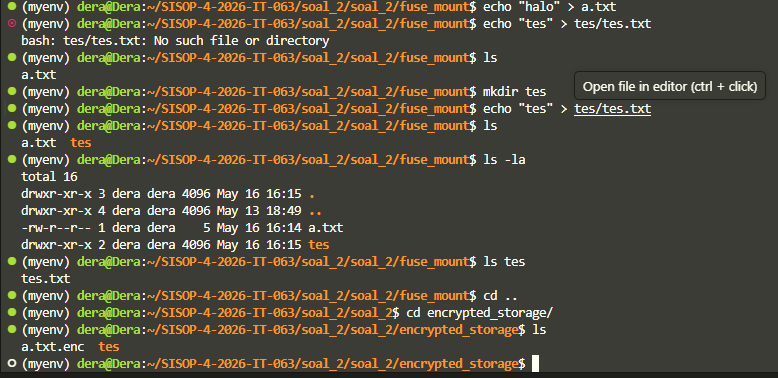

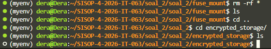


#### c - Enkripsi
Soal meminta agar user tidak perlu tahu tentang enkripsi, tapi semua file di `encrypted_storage/` tersimpan terenkripsi. Ketika user menulis file ke `fuse_mount/`, FUSE secara otomatis mengenkripsi dan menyimpannya dengan `suffix .enc`. Ketika user membaca file dari `fuse_mount/`, FUSE secara otomatis mendekripsi. File di `fuse_mount/` tampil normal tanpa `suffix .enc`, sementara file di `encrypted_storage/` tersimpan dengan `.enc` dan terenkripsi.

- Enkripsi XOR
```c
void xor_crypt(unsigned char *data, size_t len) {
    for (size_t i = 0; i < len; i++) {
        data[i] ^= ENCRYPTION_KEY;
    }
}
```

Fungsi ini beroperasi secara sederhana dengan menerapkan operasi XOR menggunakan key 0x76 pada setiap byte.

- Baca file enkripsi
```c
int read_encrypted_file(const char *path, unsigned char *buf, size_t size, off_t offset) {
    FILE *f = fopen(path, "rb");
    if (!f) return -errno;

    fseek(f, offset, SEEK_SET);
    int nread = fread(buf, 1, size, f);
    fclose(f);

    if (nread > 0) {
        xor_crypt(buf, nread);
    }

    return nread;
}
```

Fungsi ini membuka file terenkripsi, membaca bytes, mendekripsi dengan XOR, dan mengembalikan plaintext.

- Tulis file enkripsi
```c
int write_encrypted_file(const char *path, const unsigned char *buf, size_t size, off_t offset) {
    FILE *f = fopen(path, "r+b");
    if (!f) {
        f = fopen(path, "wb");
        if (!f) return -errno;
    }

    unsigned char *encrypted_buf = malloc(size);
    if (!encrypted_buf) {
        fclose(f);
        return -ENOMEM;
    }

    memcpy(encrypted_buf, buf, size);
    xor_crypt(encrypted_buf, size);

    fseek(f, offset, SEEK_SET);
    int nwritten = fwrite(encrypted_buf, 1, size, f);
    fclose(f);
    free(encrypted_buf);

    return nwritten > 0 ? nwritten : -errno;
}
```
Fungsi ini membuat copy plaintext, mengenkripsi copy dengan XOR, dan menulis encrypted bytes ke file.

- Suffic `.enc`
```c
static void get_encrypted_file_path(const char *fuse_path, char *encrypted_path, const char *encrypted_dir) {
    if (strcmp(fuse_path, "/") == 0) {
        strcpy(encrypted_path, encrypted_dir);
        return;
    }
    snprintf(encrypted_path, MAX_PATH, "%s%s.enc", encrypted_dir, fuse_path);
}

static void get_encrypted_dir_path(const char *fuse_path, char *encrypted_path, const char *encrypted_dir) {
    if (strcmp(fuse_path, "/") == 0) {
        strcpy(encrypted_path, encrypted_dir);
        return;
    }
    snprintf(encrypted_path, MAX_PATH, "%s%s", encrypted_dir, fuse_path);
}
```
Kedua fungsi ini digunakan untuk menerjemahkan path yang dilihat user di filesystem FUSE menjadi path asli yang digunakan di folder penyimpanan terenkripsi. Fungsi `get_encrypted_file_path()` dipakai untuk file, sehingga jika user mengakses path seperti `/data.txt`, maka path tersebut akan diubah menjadi bentuk fisik di folder terenkripsi dengan tambahan ekstensi `.enc`, misalnya `encrypted_storage/data.txt.enc`. Hal ini menunjukkan bahwa file yang disimpan di storage asli adalah versi terenkripsi. Sementara itu, fungsi `get_encrypted_dir_path()` dipakai untuk directory, sehingga path seperti `/folder` hanya diubah menjadi `encrypted_storage/folder` tanpa tambahan `.enc`, karena directory tidak diperlakukan sebagai file terenkripsi. Untuk path root `"/"`, kedua fungsi langsung mengembalikan `encrypted_dir` karena root FUSE merepresentasikan folder utama penyimpanan terenkripsi itu sendiri.

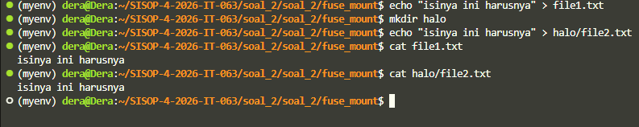

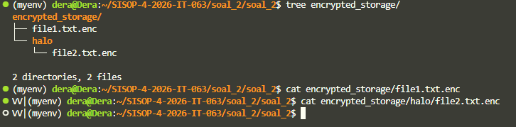

#### d - Check Fuse berhasil atau tidak
Soal mmeinta testing untuk memverifikasi bahwa FUSE implementation bekerja dengan benar. Spesifik testing adalah membuat direktori `tests/` pada direktori `encrypted_storage/`, menempatkan file `notes.csv.env`, dan memastikan file dapat dibaca melalui `fuse_mount/` dengan content terlihat (terdekripsi).


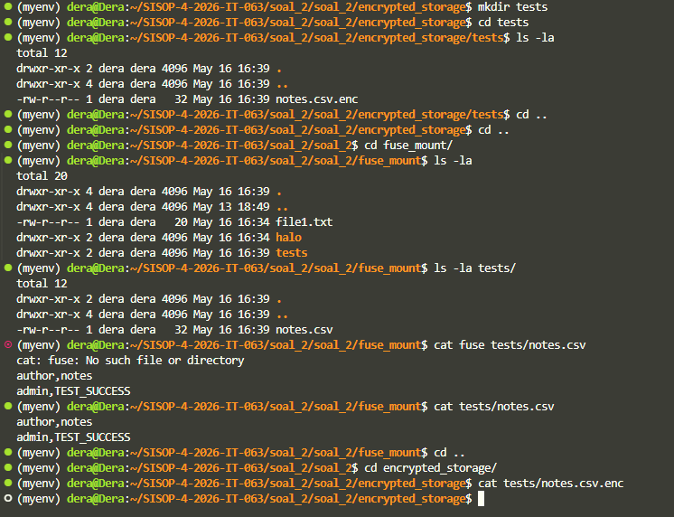


#### Container
Soal meminta database server dikemas ke dalam Docker image. Docker image adalah blueprint yang berisi OS, dependencies, dan program yang dapat dijalankan di container tanpa dependensi dari host machine. Untuk itu, diperlukan suatu Dockerfile yang mendefinisikan image. Dockerfile berisi instruksi untuk Docker dalam membangun image - mulai dari base OS, install dependencies, copy files, expose port, dan set startup command.

Image aplikasi harus dibuat dengan base image ubuntu:latest, kemudian copy program ke workdir /app dan expose PORT 9000 disertai dengan tag soal-2-modul-4-sisop.

```dockerfile
FROM ubuntu:latest

# Set working directory
WORKDIR /app

# Install necessary dependencies
RUN apt-get update && apt-get install -y \
    libfuse-dev \
    fuse \
    pkg-config \
    build-essential \
    && rm -rf /var/lib/apt/lists/*

# Copy server binary dan fuse program
COPY server /app/server
COPY fuse /app/fuse

# Create necessary directories
RUN mkdir -p /app/db \
    && mkdir -p /app/encrypted_storage \
    && mkdir -p /app/fuse_mount

# Make binaries executable
RUN chmod +x /app/server /app/fuse

# Expose port 9000 untuk database service
EXPOSE 9000

# Set environment variable untuk workdir
ENV APP_DB_PATH=/app/db
ENV ENCRYPTED_STORAGE=/app/encrypted_storage
ENV FUSE_MOUNT=/app/fuse_mount

# Start the server
CMD ["./server"]

```

- Run image
```
docker build -t soal-2-modul-4-sisop:latest .
```

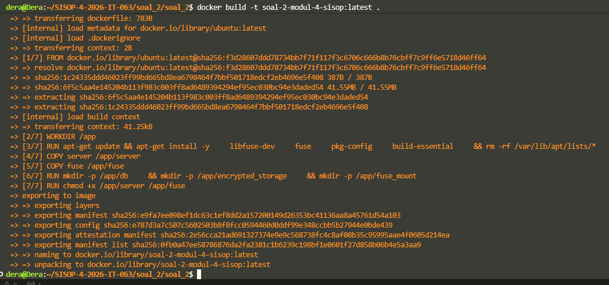

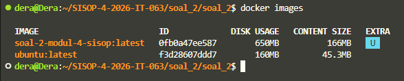

- Run container
```bash
docker run -d \
  --name db_app \
  -p 9000:9000 \
  -v $(pwd)/fuse_mount:/app/db \
  soal-2-modul-4-sisop:latest
```
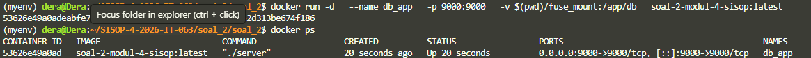

#### Integration
Soal meminta untuk membuat program bernama `client.c` yang dapat connect ke database server dan mengirimkan command serta menerima response. Server sudah disediakan dan menjalankan di container di port 9000. Client harus membuka TCP connection, mengirimkan command user, dan menampilkan response.

- clien.c
```c
#include <stdio.h>
#include <stdlib.h>
#include <string.h>
#include <unistd.h>
#include <sys/socket.h>
#include <netinet/in.h>
#include <arpa/inet.h>
#include <errno.h>

#define SERVER_IP "127.0.0.1"
#define SERVER_PORT 9000
#define BUFFER_SIZE 4096

int main() {
    int sock;
    struct sockaddr_in server_addr;
    char send_buffer[BUFFER_SIZE];
    char recv_buffer[BUFFER_SIZE];
    int bytes_received;

    // Create socket
    sock = socket(AF_INET, SOCK_STREAM, 0);
    if (sock < 0) {
        perror("socket");
        exit(EXIT_FAILURE);
    }

    // Set up server address
    memset(&server_addr, 0, sizeof(server_addr));
    server_addr.sin_family = AF_INET;
    server_addr.sin_port = htons(SERVER_PORT);
    
    // Convert IP address
    if (inet_pton(AF_INET, SERVER_IP, &server_addr.sin_addr) <= 0) {
        perror("inet_pton");
        close(sock);
        exit(EXIT_FAILURE);
    }

    // Connect to server
    if (connect(sock, (struct sockaddr *)&server_addr, sizeof(server_addr)) < 0) {
        perror("connect");
        close(sock);
        exit(EXIT_FAILURE);
    }

    printf("Connected to DB Server on port %d\n", SERVER_PORT);
    printf("Type HELP for available commands\n");
    printf("Type EXIT to quit\n");

    // Main loop for interactive session
    while (1) {
        printf("db > ");
        fflush(stdout);

        // Read user input
        if (fgets(send_buffer, BUFFER_SIZE - 1, stdin) == NULL) {
            if (feof(stdin)) {
                break;
            }
            perror("fgets");
            continue;
        }

        // Remove newline from input
        size_t len = strlen(send_buffer);
        if (len > 0 && send_buffer[len - 1] == '\n') {
            send_buffer[len - 1] = '\0';
        }

        // Check for EXIT command
        if (strcasecmp(send_buffer, "EXIT") == 0) {
            printf("Disconnecting from server...\n");
            close(sock);
            exit(EXIT_SUCCESS);
        }

        // Skip empty commands
        if (strlen(send_buffer) == 0) {
            continue;
        }

        // Send command to server
        if (send(sock, send_buffer, strlen(send_buffer), 0) < 0) {
            perror("send");
            close(sock);
            exit(EXIT_FAILURE);
        }

        // Receive response from server
        memset(recv_buffer, 0, BUFFER_SIZE);
        bytes_received = recv(sock, recv_buffer, BUFFER_SIZE - 1, 0);
        
        if (bytes_received < 0) {
            perror("recv");
            close(sock);
            exit(EXIT_FAILURE);
        } else if (bytes_received == 0) {
            printf("Server closed connection\n");
            close(sock);
            exit(EXIT_FAILURE);
        }

        recv_buffer[bytes_received] = '\0';
        printf("%s\n", recv_buffer);
    }

    close(sock);
    return EXIT_SUCCESS;
}
```

Program ini adalah client TCP sederhana yang digunakan untuk terhubung ke DB Server pada IP `127.0.0.1` dan port `9000`. Program dimulai dengan membuat socket menggunakan `socket(AF_INET, SOCK_STREAM, 0)`, di mana `AF_INET` menunjukkan bahwa komunikasi memakai IPv4, sedangkan `SOCK_STREAM` menunjukkan bahwa protokol yang digunakan adalah TCP. Setelah socket berhasil dibuat, program menyiapkan alamat server menggunakan `struct sockaddr_in`. Struktur ini dikosongkan terlebih dahulu dengan `memset()` agar tidak ada data sampah, lalu diisi dengan informasi server: `sin_family` diisi `AF_INET`, `sin_port` diisi `SERVER_PORT` yang dikonversi menggunakan `htons()` agar sesuai dengan format network byte order, dan `sin_addr` diisi IP server menggunakan `inet_pton()`, yang mengubah string `"127.0.0.1"` menjadi format alamat IP biner yang bisa dipahami oleh sistem socket. Setelah semua informasi server siap, fungsi `connect()` dipanggil untuk melakukan koneksi TCP ke server. Jika koneksi berhasil, berarti client dan server sudah terhubung, sehingga client dapat mulai mengirim perintah dan menerima balasan.

Setelah tersambung, program masuk ke interactive loop, yaitu mode di mana user dapat terus mengetik command melalui terminal. Program menampilkan prompt `db >`, lalu membaca input user menggunakan `fgets()` dan menyimpannya ke `send_buffer`. Jika user mengetik `EXIT`, program akan menutup socket dengan `close(sock)` dan keluar secara normal. Jika input kosong, program langsung kembali meminta command baru tanpa mengirim apa pun. Untuk command yang valid, program mengirim data ke server menggunakan `send()`, lalu menunggu balasan menggunakan `recv()`. Response dari server disimpan ke `recv_buffer`, diberi null terminator `\0`, kemudian ditampilkan ke layar. Jika `recv()` mengembalikan `0`, artinya server menutup koneksi, sehingga client juga berhenti. Dengan alur ini, program bekerja seperti terminal client untuk DB Server: user mengetik command, client mengirim command melalui TCP, server memprosesnya, lalu client menampilkan hasil balasan dari server.

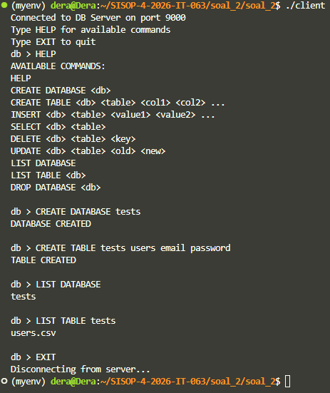

### SOAL 3 - LibraryIT

